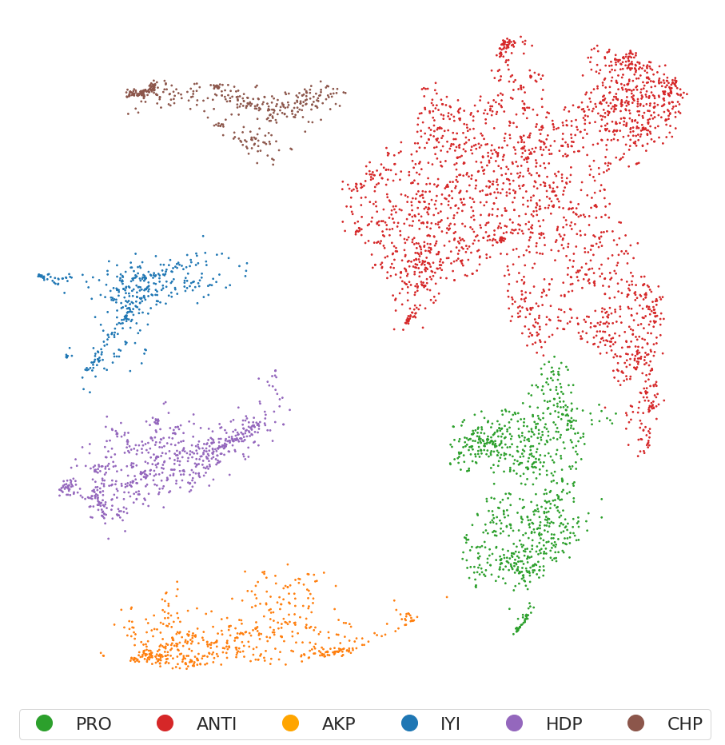
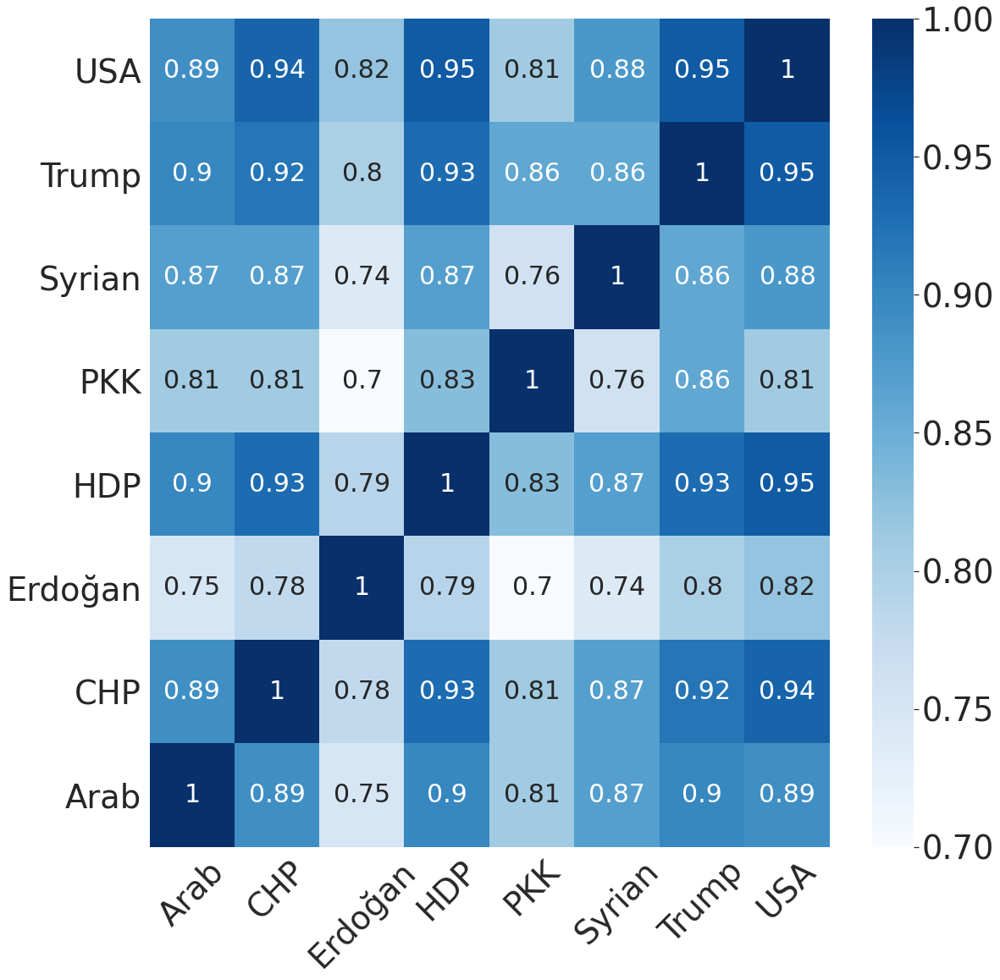
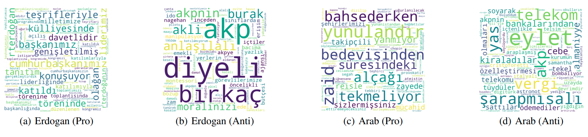

# Embedding-based Unsupervised User Stance Detection
- Paper (ICWSM'21): [Embeddings-Based Clustering for Target Specific Stances: The Case of a Polarized Turkey
](https://ojs.aaai.org/index.php/ICWSM/article/view/18082)
- Thesis (MSc August 2020): [Embeddings-Based Clustering For Target Specific Stances](https://tez.yok.gov.tr/UlusalTezMerkezi/tezSorguSonucYeni.jsp)
- We propose an unsupervised user stance detection method to capture fine grained divergences in a community across various topics. We employ pre-trained universal sentence encoders to represent users based on the content of their tweets on a particular topic. User vectors are projected into a lower dimensional space using UMAP, then clustered using HDBSCAN.
### Fine-grain stances
- Our method is able to capture stances to the party-affiliation level in a completely unsupervised manner.

### Mutual information
- Given the resultant user stances, we are able to observe correlations between topics and compute topic polarization.
 
 ### Semantic divergence between clusters
 - We identify the most prominent terms in
each cluster to show how people talk about the same issue
in different contexts.
 
#### Requirements
Note: This work was tested using umap-learn 0.3.x. Newer versions might not work as expected.
- [umap-learn 0.3.x](https://pypi.org/project/umap-learn/0.3.10/)
- [hdbscan 0.8.x](https://pypi.org/project/hdbscan/0.8.26/)
- [tensorflow-hub 0.8.x](https://pypi.org/project/tensorflow-hub/0.8.0/)
- [tensorflow-text 2.2.x](https://pypi.org/project/tensorflow-text/2.2.1/)
