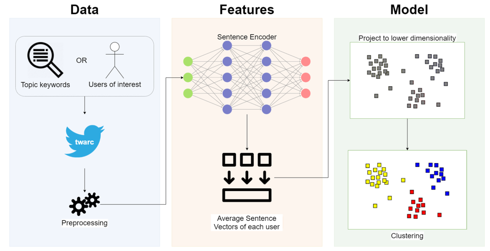

# Embeddings-Based Unsupervised Stance Detection

This repository contains the implementation of an unsupervised method for target-specific stance detection using embeddings-based clustering, as presented in our ICWSM 2021 paper.

## Publications

- **Paper (ICWSM'21)**: [Embeddings-Based Clustering for Target Specific Stances: The Case of a Polarized Turkey](https://ojs.aaai.org/index.php/ICWSM/article/view/18082)
- **Paper Presentation**: [PaperTalk ICWSM'21](https://papertalk.org/papertalks/31537)
- **Thesis (MSc August 2020)**: [Embeddings-Based Clustering For Target Specific Stances](https://tez.yok.gov.tr/UlusalTezMerkezi/TezGoster?key=fl0Kw4p1rmMDotyKRdYv1AZv-bsnninllPXAXfoe9S1sXEDBPXspE5WeUtqcCjlk)

## Overview

We propose an unsupervised method for stance detection that can capture fine-grained divergences across various topics in polarized communities. Our approach overcomes the limitations of previous methods by:

- Not requiring platform-specific features (like retweets)
- Working effectively with limited data
- Supporting hierarchical clustering without specifying the number of clusters
- Using pre-trained language models to handle morphologically rich languages

## Methodology

The method consists of five main steps:

1. **Data Collection**: Collect tweets related to specific topics or targets
2. **Feature Extraction**: Encode tweets using pre-trained universal sentence encoders
3. **User Representation**: Average tweet vectors per user to create user embeddings
4. **Projection**: Project user vectors to lower dimensional space using UMAP
5. **Clustering**: Cluster the projected vectors using HDBSCAN



## Key Features

### Fine-grained Stance Detection

Our method can automatically detect stances down to the party-affiliation level in a completely unsupervised manner, outperforming previous approaches.


### Cross-Topic Mutual Information

Using our clustering method, we can analyze the correlations between user stances across different topics, allowing for deeper insight into the structure of polarization.


### Semantic Analysis Between Clusters

We identify the most prominent terms in each cluster to show how different groups talk about the same issues in different contexts, revealing semantic divergences between polarized groups.


## Performance

Our method achieves:
- 90% precision in identifying user stances
- Over 80% recall
- Competitive performance with supervised methods, while being completely unsupervised
- Ability to detect fine-grained sub-groups that previous methods couldn't identify

## Installation

```bash
# Clone this repository
git clone https://github.com/AmmarRashed/UnsupervisedStanceDetection.git
cd UnsupervisedStanceDetection

# Create and activate a virtual environment (recommended)
python -m venv venv
source venv/bin/activate  # On Windows: venv\Scripts\activate

# Install dependencies
pip install -r requirements.txt
```

### Requirements

> **Note**: This work was tested using specific versions of packages. Newer versions might not work as expected.

- [umap-learn 0.3.x](https://pypi.org/project/umap-learn/0.3.10/)
- [hdbscan 0.8.x](https://pypi.org/project/hdbscan/0.8.26/)
- [tensorflow-hub 0.8.x](https://pypi.org/project/tensorflow-hub/0.8.0/)
- [tensorflow-text 2.2.x](https://pypi.org/project/tensorflow-text/2.2.1/)
- matplotlib
- numpy
- pandas
- tqdm

## Usage

```python
# Basic usage example
python clusterUsersUniversalSentenceEncoder.py your_data.tsv
```

The input file should be a tab-separated file with:
- First column: UserIDs
- Second column: Tweets

### Code Sample

```python
from clusterUsersUniversalSentenceEncoder import cluster_users, plot_clusters_no_labels
import tensorflow_hub as hub
import pandas as pd

# Load the universal sentence encoder
embed = hub.load('https://tfhub.dev/google/universal-sentence-encoder/4')

# Load and prepare your data
df_text = pd.read_csv('your_data.tsv', header=None, usecols=[0, 1], sep='\t')
df_text.columns = ['User', 'Text']
df_text = df_text.apply(lambda s: s.str.strip())

# Cluster users based on their tweets
cluster_users(df_text, embed, user_col='User', tweet_col='Text', save_at='results.npz')

# Visualize the clusters
plot_clusters_no_labels('results.npz.cluster')
```

## Customization Options

The method can be customized with different parameters:

- **Sentence Encoder**: Different pre-trained models can be used (multilingual, transformer-based, etc.)
- **UMAP Parameters**: Adjust `min_dist` and `n_neighbors` to control projection characteristics
- **HDBSCAN Parameters**: Modify `min_cluster_size` and `min_samples` to control clustering sensitivity

## Applications

This method has been successfully applied to:
- Political polarization analysis
- Election stance detection
- Sports fan sentiment analysis
- Cross-cultural stance detection

## Citation

If you use this code in your research, please cite our paper:

```
Rashed, A., Kutlu, M., Darwish, K., Elsayed, T., & Bayrak, C. (2021). Embeddings-Based Clustering for Target Specific Stances: The Case of a Polarized Turkey. Proceedings of the International AAAI Conference on Web and Social Media, 15(1), 537-548. https://doi.org/10.1609/icwsm.v15i1.18082
```

BibTeX format:

```bibtex
@article{rashed2021embeddings,
  title={Embeddings-Based Clustering for Target Specific Stances: The Case of a Polarized Turkey},
  author={Rashed, Ammar and Kutlu, Mucahid and Darwish, Kareem and Elsayed, Tamer and Bayrak, Cansın},
  journal={Proceedings of the International AAAI Conference on Web and Social Media},
  volume={15},
  number={1},
  pages={537--548},
  year={2021},
  doi={10.1609/icwsm.v15i1.18082}
}
```

## Contributing

Contributions are welcome! Please feel free to submit a Pull Request.

## License

This project is licensed under the MIT License - see the LICENSE file for details.

## Contact

- Ammar Rashed (ammar.rasid@ozu.edu.tr)
- Kareem Darwish (kdarwish@hbku.edu.qa)
